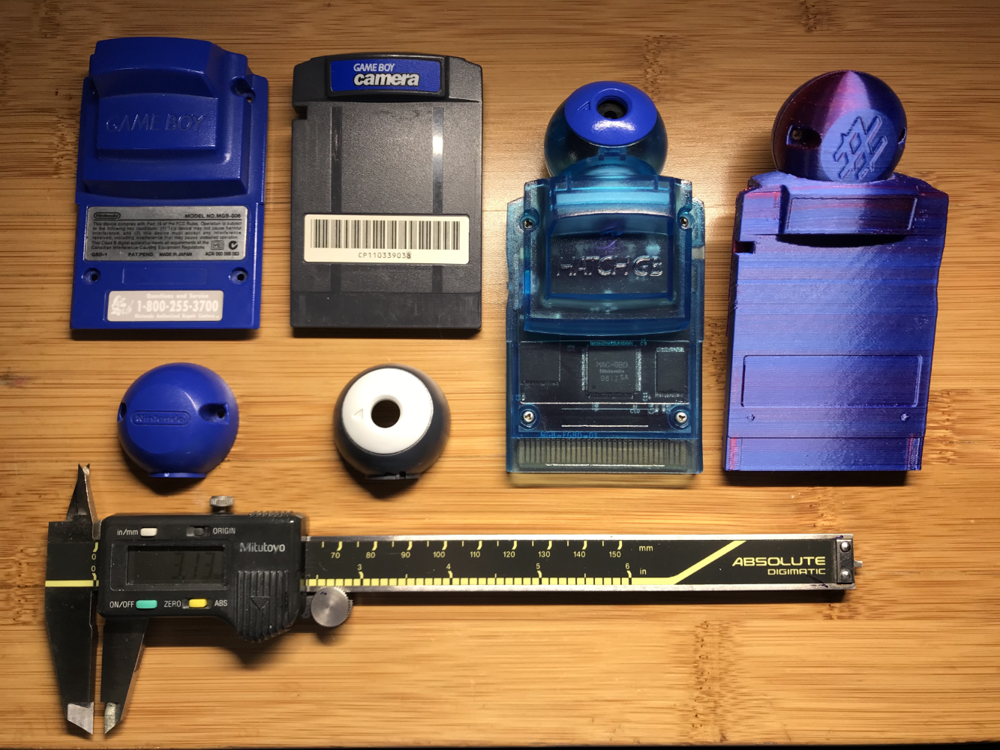
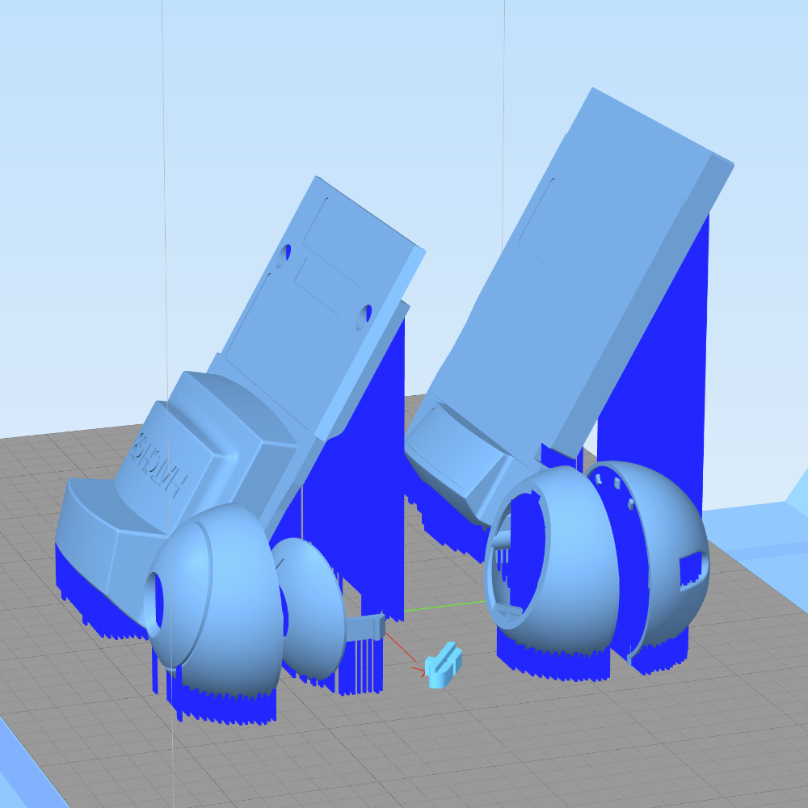
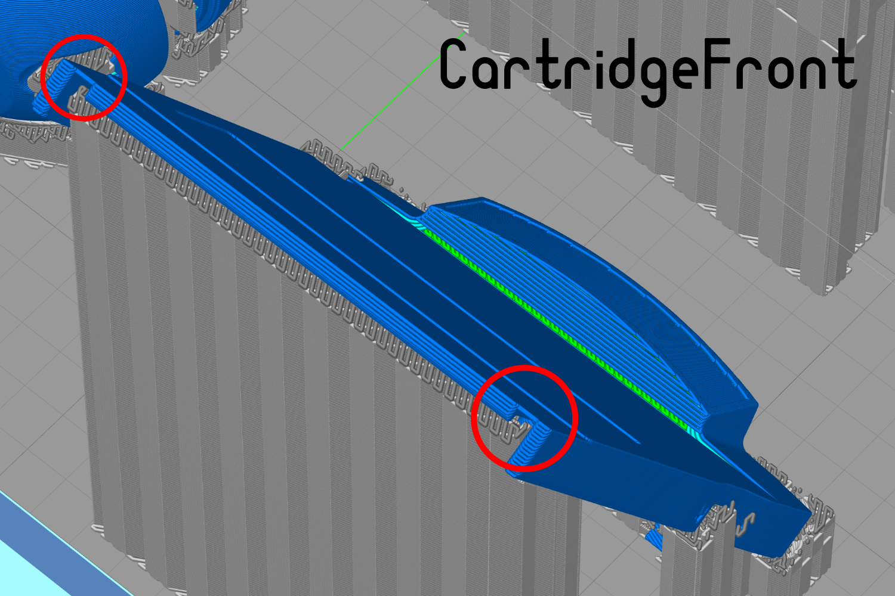
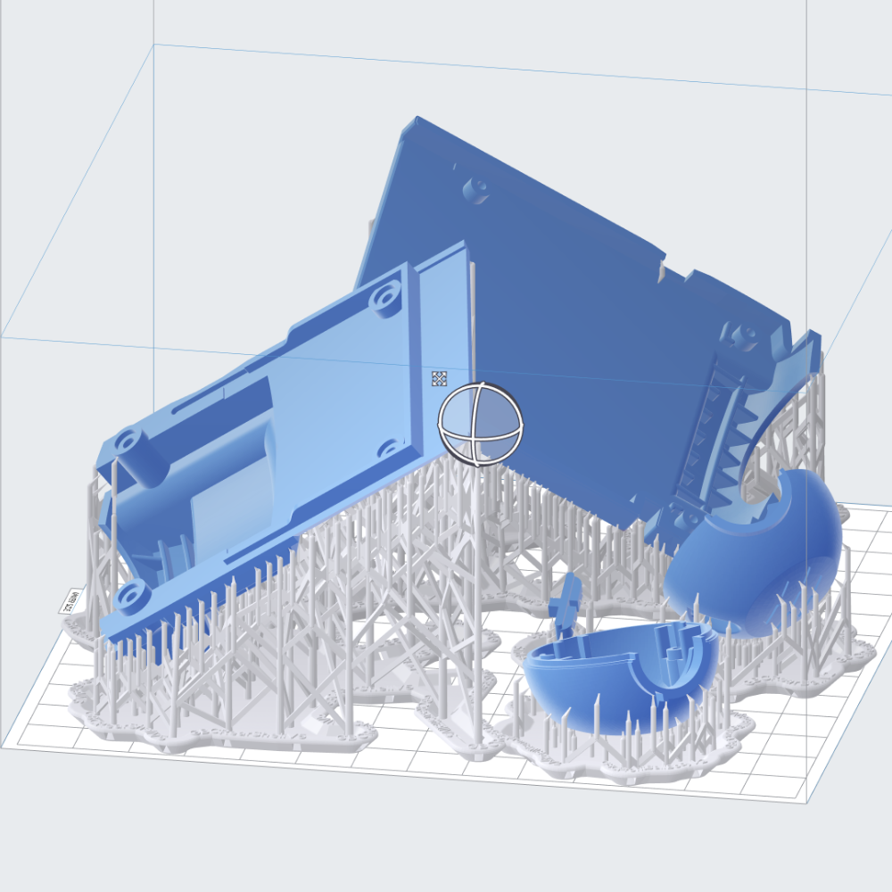
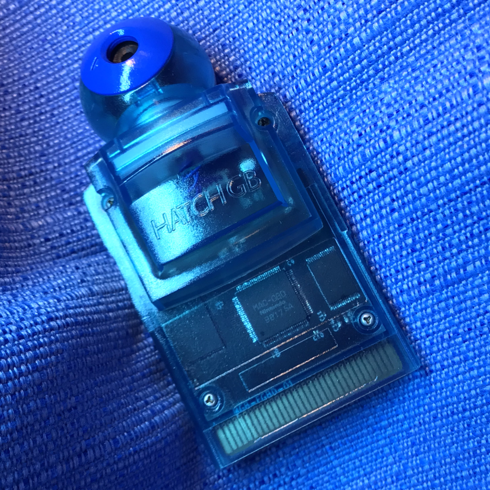
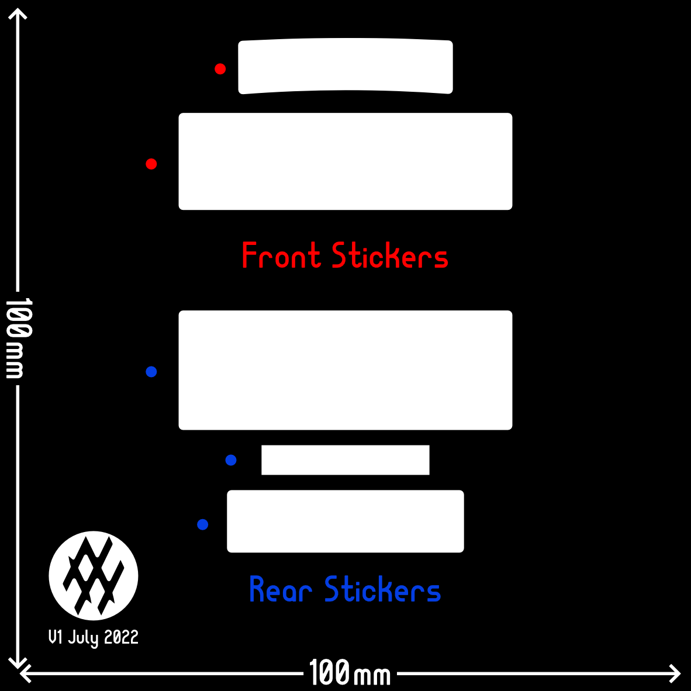

# Game-Boy-Camera-Shell
Original Gameboy Camera shell 1:1 remodeling from scratch

Repo includes source 3D files, printable models, & sticker templates for use with original mounting hardware

## The Files:

Multiple versions of the **Game-Boy-Camera-Shell** components are available to be printed.
Versions include:
 + shells for the original cartridge electronics
 + shells for use with [HDR's flashable Game Boy Camera PCB](https://github.com/HDR/Gameboy-Camera-Flashcart), with an additional switch assembly for changing rom bank without disassembling the cartridge
 + variations with my personal branding listed as **'Master'** and debranded versions as **'Blank'**
 + no Nintendo branding is present for copyright purposes

## 3D Printing Tips:

3D printing with UV curable resin, and with thermoplastics is achievable with most modern consumer grade 3D printers.

For FFF Thermoplastic reel printers, objects are oriented so that supports face the inside of the shell components to minimize surface scarring. Parts are also tilted to provide more strength on the large thin walls of the cartridge shell, vs printing them vertically.

Success was achieved using a standard (0.4mm) nozzle at 0.1-0.2mm layer height, at slow speeds (sub 30mm/s) with high temperatures (220-225C) and significant cooling for a combination of strength and accuracy.

For the most notable settings, it is important to adjust thin wall parameters, and inset each perimeter to account for tolerance. A horizontal (x&y) offset of -0.1mm was used to inset each perimeter, and 'thin walls' settings were adjusted until all walls were shown in the preview:

For photo-sensitive resin based 3D printers, it is important to tilt the objects in 2 dimensions, in order to minimize surface tensions while printing large flat objects. Unlike FFF, supports are placed on the **exterior** visible surfaces, as convex outer surfaces are easier to sand flat after support removal.

For resin parts, it is also important to thread all screw post with the original screws very slowly, and gently. Make sure to clear all holes from debris before attempting to install screws. Screws should be installed **after** cleaning parts, but **before** doing a final post cure of the resin. Parts should then be sanded smooth, and re-cleaned before sealing. Screws should remain installed during all post curing, as well as during application of a sealer/paint/clear-coat to retain shape, and to prevent clogging with debris.

## Sticker Template

The sticker template is currently untested, but vector curve PDF and PNG templates are available to test.

# Special Thanks!
These folk inspired the project, or created works that would have made this otherwise a boring task. Shout outs to:
 + the entirety of the [Game Boy Camera Club Discord](https://discord.gg/C7WFJHG) for following along, and sharing ideas
 + [Andreas Hahn](https://github.com/HerrZatacke) and [Toxa](https://github.com/untoxa) and everyone else aiding development of the amazing [2bit-PXLR-Studio](https://github.com/HerrZatacke/2bit-pxlr-studio)!
 + [Martin Refseth](https://github.com/HDR) for the fantastic [Gameboy-Camera-Flashcart](https://github.com/HDR/Gameboy-Camera-Flashcart/) that we all enjoy

## Liscense & Feedack/Help

All files are liscensed under [GNU GPL V3.0](https://www.gnu.org/licenses/gpl-3.0.en.html), so be sure to upload the source to any modifications you indend to share online. Would love to see what you make in the [Game Boy Camera Club Discord](https://discord.gg/C7WFJHG) where you can also ask for help if you are having any troubles with the files, or printing. Lastly if you enjoyed, consider grabbing me a [Coffee](https://ko-fi.com/hatch) ;)
